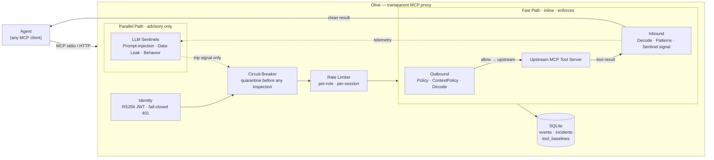

# Olive

> A zero-trust runtime security gateway for AI agents — a transparent MCP proxy that inspects every tool call **and** every tool response, blocks unauthorized actions before they execute, and stops prompt injections before they ever reach the agent, with every decision fully auditable.

[](tests/)
[](evals/)
[](evals/corpus/)
[](https://docs.astral.sh/ruff/)

---

## Overview

Olive is a transparent [MCP](https://modelcontextprotocol.io) proxy. Point any MCP client at it instead of the tool server — zero changes to the agent or the tools. Everything that crosses it is inspected in both directions.

What Olive adds to every agent interaction:

- **Cryptographic identity** — every session is bound to a signed JWT (RS256); role is identity-bound, not self-asserted
- **Default-deny policy** — unknown tools are blocked before the upstream server is ever contacted
- **Bidirectional content inspection** — tool responses, resource reads, and prompt content are screened for injection before reaching the agent
- **Session containment** — a circuit breaker quarantines a session after repeated security blocks; a quarantined agent cannot escape by re-authenticating (Siege token freeze)
- **Full audit trail** — every allow / block / hold / quarantine writes an event row with the rule that fired; raw payloads are never stored

The core design law, which governs every component:

> **Agents provide intelligence. Deterministic systems enforce authority.**

An LLM sentinel may conclude "this looks suspicious." Only the deterministic circuit breaker decides "this session is quarantined." LLM verdicts are advisory and never directly enforce.

---

## Architecture



Two paths, one rule: the **fast path is deterministic and enforces**; the **parallel path is intelligent and advises**. LLM sentinels can only emit a trip signal to the circuit breaker, which applies deterministic quarantine. An LLM cannot override, downgrade, or bypass any enforcement decision.

---

## Attack Surfaces Covered

| Surface | Direction | What Olive does |
|---|---|---|
| Tool call requests | agent → tool | Default-deny policy check; contextual authorization (resource binding, classification ceiling, approval hold) |
| Tool responses | tool → agent | Decode layer (base64/hex/rot13/url/homoglyph) + trigger-phrase matching + LLM semantic sentinel |
| Tool descriptions / schemas | server → agent | Content-inspected at `tools/list`; poisoned declarations withheld and logged |
| Rug-pull swaps | server → agent | Trust-on-first-use baselines; a changed declaration is withheld until operator re-approves |
| Resource reads | tool → agent | `resources/read` content inspected identically to tool responses |
| Rendered prompts | tool → agent | `prompts/get` content inspected identically to tool responses |
| Agent identity | per-session | RS256 JWT verified against CA pubkey; expired/forged/replayed token → 401 before gateway reached |
| Privilege escalation | outbound arguments | Exfiltration-via-arguments corpus cases; Data-Leak sentinel on outbound |
| Slow-burn session drift | cross-call | Behavior sentinel: call-rate anomaly (≥5× historical average) + novel-tool detection |
| Quarantine escape | re-authentication | Siege token freeze: live JTIs revoked on quarantine; bulk-revoked on Siege escalation |

---

## Features

### Bidirectional enforcement pipeline

Olive inspects both directions on every MCP surface — not just `tools/call`:

- **Outbound (agent → tool):** `PolicyInspector` (default-deny allowlist per role) → `ContextPolicyInspector` (resource binding, classification ceiling, approval hold) → `DecodeInspector` (layer 0.5: normalizes encoding before matching)
- **Inbound (tool → agent):** `DecodeInspector` → `PatternInspector` (trigger-phrase matching, Unicode NFKC-normalized) → LLM `PromptInjectionSentinel` (advisory, parallel path)
- **`tools/list`, `resources/list`, `prompts/list`:** every declaration content-inspected; poisoned or rug-pulled declarations withheld, not forwarded
- **`resources/read`, `prompts/get`:** content inspected identically to tool responses

Pipeline decisions: `allow | block | hold | quarantine`. First non-allow verdict short-circuits. Any inspector exception → `block` (fail closed, never silent pass-through).

### Contextual authorization

Beyond "this role may call this tool":

- **Task resource binding** — a call can be restricted to the specific resource the agent's current task is scoped to; `resource.id_in: task.resources` blocks anything outside
- **Data classification ceilings** — an agent role can be barred from accessing resources above a classification level even if the tool itself is allowed
- **Operator approval holds** — high-risk calls emit a `hold` verdict (no incident, no breaker trip); a capability-gated (`olive:approve`) operator releases one specific, exact call — one-shot, argument-specific, never by an LLM

### Session containment & operating modes

- **Circuit breaker** — trips deterministically when a session accumulates `max_blocks_before_quarantine` security blocks; every subsequent call denied before any inspector runs or upstream contacted
- **Operating modes** (`normal / suspicious / siege`) — Suspicious halves the containment threshold; Siege collapses it to one block; only a capability-gated (`olive:command`) human de-escalates
- **Security Commander** — deterministic code (not an LLM); sole caller of `set_mode`; escalates monotonically from the detection stream
- **Siege token freeze** — on quarantine trip, the session's live JWT is revoked in-memory and persisted; on Siege escalation, the Commander bulk-revokes all quarantined sessions' tokens; a contained agent cannot re-authenticate to escape

### Measured detection — not claimed detection

Detection is **measured continuously** against a maintained attack corpus. The eval runner is a CI regression gate; detection can never silently drop.

| Metric | Current |
|---|---|
| Corpus cases | 109 (active + known-miss + benign hard negatives) |
| Detection rate | **56 / 56 active cases** |
| False-positive rate | **0** |
| Known-miss (honest backlog) | Encoded/semantic bypasses layer-zero can't catch; visible in the report |
| Tests | **387 passing** |

Every red-team bypass becomes a corpus case (`known-miss` until fixed). Every promoted fix raises the baseline. Known misses stay visible — a gateway that hides its blind spots is marketing.

### The company of agents (build-time + runtime)

Olive is backed by a structured agent company. Build-time agents run at development time under human supervision; runtime departments run alongside the gateway in production.

**Build-time agents** (`.claude/agents/`):

| Agent | Role |
|---|---|
| `architect` | Reviews designs against ARCHITECTURE.md and ADRs before implementation |
| `security-reviewer` | Reviews every diff touching enforcement code |
| `red-team` | Generates bypass attempts; every bypass becomes a corpus case |
| `builder` | Proposes a fix as a reviewable diff; never applies to prod |
| `qa` | Verifies test coverage and the end-to-end demo flow at milestone close |

**Runtime departments** (wired by `build_runtime_org`):

| Department | What it does |
|---|---|
| Defense (`SentinelRunner`) | Aggregates sentinel signals; sole caller of `breaker.trip` |
| Remediation (`RemediationLedger`) | Subscribes to `reproduced` bus objects; opens a fix cycle |
| Red-Team (`redteam_dept`) | Scheduled sandbox campaigns against `build_pipeline`; publishes bypass findings; **never touches live traffic** |
| Builder (`builder_dept`) | Reacts to confirmed weaknesses; emits bounded fix-proposals; **never authors a diff or calls trip/set_mode** |

### The full security cycle

```
Govern → Detect → Contain → Reproduce → Repair → Verify → Learn & strengthen
```

The remediation cycle ledger (`intelligence/remediation.py`) walks an incident through `reproduced → fix-proposed → verified → approved → learned`. Two transitions are human-only: **verify** is writable only from the real `evals/run_evals.py` gate result; **learn** is refused without a capability-gated (`olive:remediate`) approval. No LLM can self-verify or self-approve a change to the security system.

### Agentic Command Center

- **`olive ui`** — a Textual TUI showing department status, live mitigation feed, and an attack-theater sidebar (fires sandbox drills over `evals/corpus/`, never live traffic)
- **`olive ui --web`** — a Starlette/WebSocket server pushing the same event stream to a browser dashboard; `POST /operator` is announce-only (no enforcement actions reachable)
- **`olive serve --ui`** — co-mounts gateway + dashboard in one process, sharing one incident bus and circuit breaker so the dashboard shows the live incident stream; `/mcp` stays bearer-protected

---

## Security Design

### Non-negotiable rules

These govern all enforcement code in this repo. Violating one is a bug even if tests pass.

| Rule | What it means |
|---|---|
| All tool output is untrusted input | Trust labels tune inspection depth, never disable it. Trusted sources still get layer-zero checks |
| LLM verdicts are advisory only | Enforcement decisions (allow / block / hold / quarantine) are made by deterministic code only. An LLM sentinel may only emit a signal |
| Never log raw payloads | Tool arguments and response bodies may contain secrets/PII. Only SHA-256 hashes + bounded evidence excerpts (≤200 chars, matched region only) |
| Fail closed | If an inspector or the pipeline errors, the decision is `block`, logged with the error as evidence. Never silently pass through |
| Every decision is auditable | Each allow / block / hold / quarantine writes an event row with the rule that fired and why. No silent decisions |

### Threat model → mitigation

| Threat | Mitigation |
|---|---|
| Prompt injection in tool responses | Decode layer (base64/hex/rot13/url/homoglyph normalization) + pattern matching + LLM semantic sentinel; all advisory verdicts pass through deterministic gate |
| Indirect injection via tool/resource/prompt listings | All `*/list` declarations content-inspected; poisoned items withheld and logged |
| Rug-pull (description changes between sessions) | Trust-on-first-use baselines; changed declaration withheld until `olive reset-baselines`; logged as `tool-rug-pull` |
| Privilege escalation via tool arguments | Default-deny + contextual authorization; outbound arguments visible to Data-Leak sentinel |
| Compromised agent mid-session | Circuit breaker trips on repeated blocks; Siege mode quarantines sooner; operating mode is monotonically escalating (only human can de-escalate) |
| Forged or replayed identity | RS256 JWT verified against CA pubkey; algorithm pinned; expiry + audience checked; fail-closed 401 before gateway reached |
| Quarantine escape via re-authentication | Live JWT revoked on quarantine trip; Siege bulk-revokes all quarantined sessions' tokens |
| Slow-burn exfiltration not caught per-call | Cross-session behavioral baselines: call-rate anomaly (≥5× historical) + novel-tool-first-ever detection |
| Forged bus objects from compromised LLM | Incident bus objects are HMAC-signed; unsigned or tampered object rejected fail-closed |
| Builder/Red-Team department causing enforcement harm | Structural guarantees enforced by import-set tests: these modules cannot import proxy/upstreams/breaker/ClientSession |
| LLM self-approving a fix | `learn` transition refuses without a capability-gated `olive:remediate` human approval; `verify` writable only from real eval gate subprocess result |

### Audit store schema

```sql
CREATE TABLE events (
    event_id TEXT PRIMARY KEY, timestamp TEXT NOT NULL,
    agent_id TEXT NOT NULL, session_id TEXT NOT NULL,
    organization_id TEXT NOT NULL, role TEXT NOT NULL,
    tool TEXT NOT NULL, direction TEXT NOT NULL,
    decision TEXT NOT NULL, policy_rule TEXT,
    arguments_hash TEXT, latency_ms INTEGER, incident_id TEXT
);
CREATE TABLE incidents (
    incident_id TEXT PRIMARY KEY, timestamp TEXT NOT NULL,
    agent_id TEXT NOT NULL, session_id TEXT NOT NULL,
    attack_type TEXT NOT NULL, evidence TEXT NOT NULL,
    confidence REAL, detection_method TEXT NOT NULL,
    decision TEXT NOT NULL, status TEXT NOT NULL
);
```

Raw payloads are never stored — hashes + bounded evidence excerpts only.

---

## Project Structure

```
olive/
├── docs/
│   ├── VISION.md              Product thesis, market, differentiation
│   ├── THREAT_MODEL.md        Assets, surfaces, guarantees, non-guarantees
│   ├── ARCHITECTURE.md        Full system design (read before touching enforcement)
│   ├── EVALS.md               How detection is measured
│   ├── ROADMAP.md             Milestone plan
│   └── decisions/             ADRs — one per irreversible/architectural decision
├── policies/
│   ├── default.yaml           Role allowlists + trust labels (single upstream)
│   ├── multi.yaml             Multi-upstream example
│   └── contextual.yaml        Contextual authorization rules
├── src/olive/
│   ├── cli.py                 `olive` entry point (run / serve / ui / cycle / redteam)
│   ├── gateway/
│   │   ├── proxy.py           MCP proxy core — bidirectional inspection
│   │   ├── context.py         SecurityContext — one frozen object per inspected call
│   │   ├── pipeline.py        Inspector pipeline — fail-closed, short-circuit
│   │   ├── breaker.py         Circuit breaker — sole quarantine/mode-set authority
│   │   ├── session.py         Per-session mutable state
│   │   ├── mode.py            OperatingMode (normal / suspicious / siege)
│   │   ├── ratelimit.py       Per-role sliding-window rate limiter
│   │   ├── upstreams.py       Multi-upstream routing (namespaced tool names)
│   │   ├── approvals.py       Hold/approval registry (capability-gated release)
│   │   └── telemetry.py       TelemetrySink seam (open-core boundary)
│   ├── inspectors/
│   │   ├── policy.py          Default-deny tool allowlist per role
│   │   ├── context_policy.py  Contextual authz (resource binding, ceilings, hold)
│   │   ├── patterns.py        Trigger-phrase matching, Unicode NFKC-normalized
│   │   └── decode.py          Decode layer (base64/hex/rot13/url/homoglyph → re-match)
│   ├── identity/
│   │   ├── tokens.py          Mock CA — RSA keypair, real RS256 JWT sign/verify
│   │   └── claims.py          IdentityClaims — transport-independent identity object
│   ├── intelligence/
│   │   ├── sentinels/         Prompt-Injection · Data-Leak · Behavior sentinels (advisory)
│   │   ├── commander.py       Security Commander — deterministic mode escalation
│   │   ├── bus.py             Incident bus — HMAC-signed pub/sub + audit table
│   │   ├── remediation.py     Remediation cycle ledger (reproduced→learned state machine)
│   │   ├── redteam_dept.py    Runtime Red-Team department (sandbox only)
│   │   └── builder_dept.py    Runtime Builder department (propose only)
│   ├── redteam/               Offline red-team engine (AttackStrategy mutators)
│   ├── transport/
│   │   └── http.py            `olive serve` — streamable HTTP + bearer auth
│   ├── store/
│   │   └── events.py          SQLite audit store (aiosqlite)
│   └── ui/
│       ├── app.py             Textual TUI (`olive ui`)
│       ├── web.py             Starlette/WebSocket dashboard (`olive ui --web`)
│       └── broker.py          UIBroker — read-only TelemetrySink + bus subscriber
├── evals/
│   ├── corpus/                Attack corpus — 109 YAML cases
│   ├── run_evals.py           Eval runner + CI regression gate
│   └── baseline.json          Pinned detection counts (gate fails on backslide)
├── tests/                     387 pytest unit + integration tests
├── demo/
│   ├── tools_server.py        Demo MCP tool server
│   └── run_demo.py            Scripted demo: allow / block escalation / block injection
└── CLAUDE.md                  Engineering constitution + agent company process
```

---

## Quickstart

```bash
pip install -e ".[dev]"

# full walking-skeleton demo: allow / block escalation / block injection
python demo/run_demo.py

# measured detection against the attack corpus (honest numbers)
python evals/run_evals.py

# run the gateway yourself in front of any stdio MCP server
olive run --config policies/default.yaml -- python demo/tools_server.py

# one gateway fronting several servers (tools namespaced server.tool)
olive run --config policies/multi.yaml

# or over HTTP with bearer-token identity enforced on the wire
olive serve --config policies/default.yaml --ca-pubkey ca_pub.pem -- python demo/tools_server.py

# gateway + live Command Center dashboard in one process
olive serve --config policies/default.yaml --ca-pubkey ca_pub.pem --ui -- python demo/tools_server.py
```

## What the demo shows

1. **Legitimate work flows freely** — allowed tools pass through, responses inspected and released.
2. **Privilege escalation blocked outbound** — a forbidden tool call is stopped *before* the tool server is ever contacted; incident logged.
3. **Prompt injection blocked inbound** — a poisoned document returned by a tool is caught and never reaches the agent; the session's audit trail shows exactly which rule fired.

---

## Development

```bash
pytest            # 387 unit + end-to-end tests (real MCP over stdio)
ruff check .      # lint
python evals/run_evals.py          # detection report
python evals/run_evals.py --update-baseline  # lock in a detection win
```

### Workflow conventions

- **Architectural / irreversible decisions** → write an ADR in `docs/decisions/` *before* implementing.
- **Changes touching `gateway/` or `inspectors/`** → run the `security-reviewer` agent on the diff before considering the work done.
- **New or changed detection logic** → run the `red-team` agent to attempt bypasses; every bypass found becomes a new `evals/corpus/` case.
- **Before closing a milestone** → run the `qa` agent to verify test coverage and the end-to-end demo flow.
- Nothing merges without tests. Demo scenarios in `demo/` must also be covered by real tests in `tests/`.

---

## Documentation

| Doc | What it covers |
|---|---|
| [docs/VISION.md](docs/VISION.md) | Product thesis, market, differentiation |
| [docs/THREAT_MODEL.md](docs/THREAT_MODEL.md) | Assets, surfaces, guarantees and non-guarantees |
| [docs/ARCHITECTURE.md](docs/ARCHITECTURE.md) | The proxy, inspector pipeline, audit store |
| [docs/EVALS.md](docs/EVALS.md) | How detection is measured |
| [docs/ROADMAP.md](docs/ROADMAP.md) | Milestone plan |
| [docs/decisions/](docs/decisions/) | ADRs |
| [CLAUDE.md](CLAUDE.md) | Engineering constitution + the agent company process |

---

## Status

**Milestones 1–7 + M11 first slice complete on `main`.** Real MCP protocol, real bidirectional enforcement, real audit trail. Identity, containment, multi-upstream routing, the full MCP surface (tool descriptions, resources, prompts), contextual authorization, measured detection (CI-gated eval corpus), advisory LLM sentinels, the complete department cycle (Reproduce → Repair → Verify → Learn), operating modes (Normal / Suspicious / Siege), Siege token freeze, and the web dashboard are all shipped.

See [docs/ROADMAP.md](docs/ROADMAP.md) for what's next: cross-process fleet shared state, multi-gateway control plane, and the supervisor tier.
